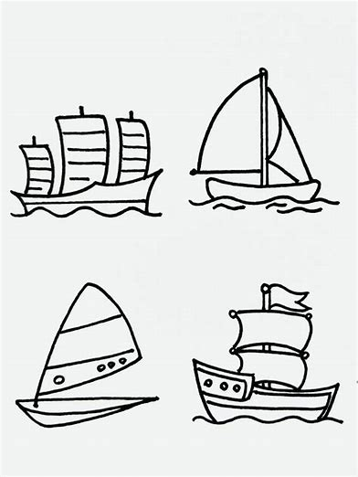

# Markdown学习笔记

[TOC]

## .字体

### .标题

`## 文字`

几级标题几个 `#`，最多 6 个。

### .加粗

`**文字**` 或 `__文字__`

效果：**文字**

### .斜体

`*文字*` 或 `_文字_`

效果：_文字_

要插入普通的 `*` 或 `_`，可以使用 `\`（转义），如 `\*文字`。

效果：\*文字

### .删除线

`~~文字~~`

效果：~~文字~~

### .下划线

`<u>文本</u>`_【不推荐Inline HTML】_

效果：<u>文本</u>

### .黄色底框

`==文本==`

效果：==文本==

### .字体颜色

`<font color=red>文本</font>`_【不推荐Inline HTML】_

效果：<font color=red>文本</font>

## .列举

### .无序列表

`+/-/* 文字`

效果：

- 文字
  - 文字
    - 文字

`+/-/*` 和文字之间要有空格，多层嵌套 ~~打 `Tab`~~ 或2个空格，同一列表保持符号一致。

### .有序列表

`1. 文字`

效果：

1. 文字
1. 文字

前面数字多少不重要，`.` 和后面文字之间要有空格。

### .复选框

`- [ ] 任务`

效果：

- [ ] 任务

## .代码

### .单行代码

``文本``

效果：``文本``

### .代码块

```plaintext
` ` `language
  代码...
  代码...
` ` `
```

效果：

```plaintext
  代码...
  代码...
```

或在代码前缩进一个Tab，注意前面要有空行：

```markdown
    代码...
    代码...
```

效果：

```markdown
  代码...
  代码...
```

显示代码行数，添加 `line-numbers class`，例如：

```plaintext
` ` `javascript {.line-numbers}
function add(x, y) {
  return x + y
}
` ` `
```

效果：

```javascript {.line-numbers}
function add(x, y) {
  return x + y
}
```

## .图表

### .图片

**原先默认设置**：

- ``
- `` _【不推荐Inline HTML】_

**修改后**：

- ``

示例：

1. ``
   

2. ``
   

- 多图排版与图片效果

示例：

`  `
  

- 左右对齐

示例：

``


- 浮动排版

示例：


> [!WARNING]
> 浮动排版在子列中会失效

``啊啊啊啊啊啊宝宝你是一个香香软软甜甜糯糯蜂蜜奶油甜甜腻腻酥酥脆脆滑滑嫩嫩绵绵密密弹弹润润丝丝滑滑蓬蓬松松香香甜甜油油润润细细软软密密实实润润甜甜酥酥软软嫩嫩滑滑松松软软甜甜蜜蜜细细绵绵香香浓浓弹弹嫩嫩香香甜甜酸酸甜甜辣辣爽爽咸咸鲜鲜苦苦甘甘滑滑嫩嫩酥酥脆脆软软绵绵弹弹润润油油腻腻清清爽爽浓浓醇醇淡淡幽幽热热乎乎冰冰凉凉黏黏糊糊爽爽脆脆鲜鲜嫩嫩辣辣麻苦苦辣辣酱油醋橄榄油菜籽油葵花籽油鱼虾蟹龙虾贝类牛肉羊肉猪肉鸡肉鸭肉鹅肉火鸡肉香肠火腿培根肉丸汉堡热狗披萨寿司拉面咖喱炖肉烤肉烤鱼烤鸡沙拉汤粥芒果柠檬柚子百香果茼蒿芥蓝芹菜荠菜苋菜意式烤蔬菜配香草酱和橄榄油鲜美多汁香脆可口滑嫩浓郁醇厚甘甜爽口香辣酸甜苦辣咸香酥软糯滑爽劲道鲜美清香扑鼻诱人色泽鲜艳香气扑鼻口感丰富层次分明风味独特香气四溢回味无穷色香味俱佳口感细腻肉质鲜嫩色泽金黄外酥里嫩香气浓郁味道鲜美口感滑嫩味道醇厚味道独特风味独特香气诱人口感鲜美味道浓郁口感丰富味道鲜美味道醇厚味道独特香气扑鼻口感细腻肉质鲜嫩色泽金黄外酥里嫩香气浓郁味道鲜美口感滑嫩味道醇厚味道独特风味独特香气诱人口感鲜美味道浓郁口感丰富味道鲜美味道醇厚味道独特香气扑鼻的小蛋糕

### .表格

```plaintext
| c2: 标题1 |      \     |     标题2    | 标题3 |
| --------- | ---------- | ------------ | ----- |
|   文本1   | :c2: 文本2 |       \      |  \\\  |
|  r2 文本3 |    文本4   | :r2c2: 文本5 |   \   |
|     \     |    文本6   |       \      |   \   |
```

效果：

<!-- | c2: 标题1 |      \     |     标题2    | 标题3 |
| --------- | ---------- | ------------ | ----- |
|   文本1   | :c2: 文本2 |       \      |  \\\  |
|  r2 文本3 |    文本4   | :r2c2: 文本5 |   \   |
|     \     |    文本6   |       \      |   \   | -->

|     \     |      \     |       \      |   \   |
| --------- | ---------- | ------------ | ----- |
| c2: 标题1 |      \     |     标题2    | 标题3 |
|   文本1   | :c2: 文本2 |       \      |  \\\  |
|  r2 文本3 |    文本4   | :r2c2: 文本5 |   \   |
|     \     |    文本6   |       \      |   \   |

短划线 `-` 不少于 3 个，为对齐可以写 5 个。

默认 `-----` 标题居中，内容居左。

居中在短划线 `-` 两侧加 `:`，如 `:----:`，居左/右只在短划线 `-` 左/右侧加 `:`。

## .引用相关

### .引用

`> 文字`

效果：

> 文字

只需要第一行有 `>`，行末加 2 个空格换行；**以空行为结束标志**。

可多层引用，第几层用几个 `>`，例如：

```
> 这是第一行
>> 这是第二行
>>> 这是第三行
```

效果：
> 这是第一行
>> 这是第二行
>>> 这是第三行

### .Callout

```markdown
> [!abstract] 这里可以修改标题
> 这是 Callout 语法
```

> [!abstract] 这里可以修改标题
> 这是 Callout 语法

> [!tip]+
> Callout 语法是支持展开的
> 只需要在 `[!]` 后加上 `+/-` 即可
> 也即本例中的 `> [!tip]+`
>> [!tip]- 也可以默认收起
>> 还能递归展开

> [!warning]
> 默认收起的 Callout 在打印时不会自动显示
> 如果需要自动展开，必须使用 `<script>` 标签处理打印事件

> [!info]
> 下面是支持的其他样式

> [!success]

> [!question]

> [!failure]

> [!danger]

> [!bug]

> [!example]

> [!quote]

### .链接

- `[标题](网址)` （带标题）
- `<网址>` （不带标题）_【不推荐Inline HTML】_

效果：

- [title](url)（带标题）
- <url>（不带标题）_【不推荐Inline HTML】_

## .排版

### .长代码

```python
def resolve_extension_dir(
    extensions_root: Path,
    extension_pattern: str,
    explicit_extension_dir: Optional[Path] = None,
) -> Path:
    if explicit_extension_dir is not None:
        if not explicit_extension_dir.exists():
            raise FileNotFoundError(f"Extension directory not found: {explicit_extension_dir}")
        return explicit_extension_dir

    matches = sorted(extensions_root.glob(extension_pattern))
    if not matches:
        raise FileNotFoundError(
            "No extension directory matched pattern "
            f"'{extension_pattern}' under '{extensions_root}'"
        )

    # Pick the latest-looking directory by lexical order to handle version suffixes.
    return matches[-1]
```

### .换行

- 软换行：行末加 2 空格 + 1 回车。
- 硬换行：2 回车。

效果：

> 这是第一行  
> 这是软换行
>
> 这是硬换行

不建议只用 1 回车，部分平台不兼容。

### .分割线

`---` 或 `***`

效果：

---

### .自动目录

`[TOC]`

效果类似于：

- [第一章](none)
  - [1.1 节](none)
  - [1.2 节](none)

**注：** 不是很好看

### .手动目录

`- [标题](#标题)`

本电脑采用 `- [$0]($0)` 的代码自动补全脚本。

**注意**：需手动将大写字母转为小写、空格转为连字符 `-`。

Markdown 生成 “锚点 ID” 的规则：

- **所有字母转换为小写**。
- **空格转换为连字符 `-`**。
- 移除或转换特殊字符：绝大多数标点符号（如 `,` `.` `!` `?` `:` `;` `@` `&` `、` 等）与 HTML 标签会被直接移除 / 转换为连字符。
- 合并连续连字符：如果因为空格和特殊字符产生了多个连续的连字符 `--`，会被合并成一个。
- 处理重复标题：若锚点 ID 重复，后续标题会在后面添加数字。

不同平台处理细节可能有差异，因此可能需要显式、手动地定义锚点 ID：

```markdown
## .我的标题 {#my-custom-id}

[链接到我的标题](#my-custom-id)
```

## .多列排版

使用 `|||-` 来开始一个多列排版，`|||` 来分隔列，`-|||` 来结束多列排版，可以添加参数用来设置列宽和对齐方式

|||-::

 

|||60

> [!TIP]
> 使用 `::` 要求其在竖直方向上居中对齐
> 还可以使用数字来指定列宽，不提供时默认平均分配
> 比如 `:240px` 表示列宽 240px 且向上对齐
> 比如 `:50%:` 表示列宽 50% 且居中对齐
> `%` 也可以省略
> 此外，单独的 `:` 表示向下对齐

-|||

|||-::

```markdown
|||-::

 

|||60

> [!TIP]
> 使用 `::` 要求其在竖直方向上居中对齐
> 还可以使用数字来指定列宽，不提供时默认平均分配
> 比如 `:240px` 表示列宽 240px 且向上对齐
> 比如 `:50%:` 表示列宽 240px 且居中对齐
> `%` 也可以省略
> 此外，单独的 `:` 表示向下对齐

-|||
```

|||40

- 左边展示了上方布局的 markdown 代码
- 在多列布局中除了浮动排版的图片外所有语法均可使用
- 比如下面的表格
- 但要注意由于列宽变窄代码块很容易被截断，像左边那样

| c2: 标题1 |      \     |     标题2    | 标题3 |
| --------- | ---------- | ------------ | ----- |
|   文本1   | :c2: 文本2 |       \      |  \\\  |
|  r2 文本3 |    文本4   | :r2c2: 文本5 |   \   |
|     \     |    文本6   |       \      |   \   |

-|||

## .导入

`@import "./Markdown笔记.pdf" {page_no=1}`

@import "./Markdown笔记.pdf" {page_no=1}
